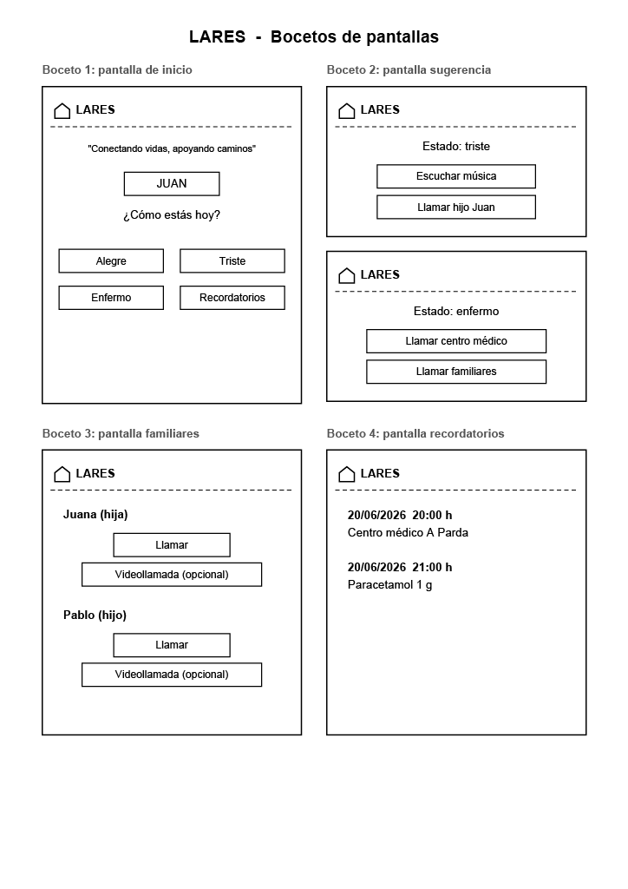

# Plantilla: propuesta del Proyecto A

---

## 0 · Datos

| | |
|---|---|
| **Nombre de la app** |LARES |
| **Autor/a** |Romina García García |
| **Fecha** |01/10/2026|

---

## 1 · La idea en una frase
> Qué hace tu app y para quién, en una sola frase.
>Aplicación para conectar a personas mayores con familiares y centro de salud directamente.
> Fórmula: «Una app que permite a [quién] hacer [qué] para [para qué].»

Una aplicación que permite a las personas mayores conectar con familiares y centros de salud según su
estado anímico para hacer frente la soledad no deseada.

---

## 2 · El problema
> ¿Qué problema resuelve? ¿Cómo se resuelve hoy sin tu app?

Muchas personas mayores tienen dificultades para entender la tecnología, debido a interfaces complejas 
o deficientes adaptaciones de la iconografía y letra. Además, existe un creciente aumento de la soledad
no deseada, provocado, en muchos casos, por el ritmo de vida y trabajo de los familiares, lo que puede
generar sentimientos de aislamiento, falta de acompañamiento y desánimo.

En la actualidad, este problema se resuelve a través de visitas presenciales o llamadas telefónicas que,
no siempre, se encuentran adaptadas a las necesidades de este colectivo. Por ello, LARES pretende facilitar
y adaptar la comunicación de las personas mayores con sus familiares y centros sociosanitarios, sin que 
ello sea un proceso complejo.

## 3 · Personas usuarias

> ¿Quién la va a usar? Describe a una persona concreta: edad, soltura con la
> tecnología, cuándo y dónde abre la app, cuánto tiempo le dedica y qué pasa
> si le falla.

Juana, de 78 años, reside sola en su domicilio y utiliza una tablet para comunicarse con sus familiares. 
La aplicación se usará a través de una tablet, puesto que el dispositivo ofrece una mayor visualización 
de iconografía y adaptación de la interfaz por su tamaño de pantalla.
La usuaria tendrá conocimientos muy básicos de tecnología, puesto que la interfaz será simple, intuitiva
y adaptada a sus necesidades visuales. El dispositivo permanecerá en su hogar y solo necesitará dedicarle
unos minutos para registrar estados de ánimo y visualizar recordatorios de citas. 
Si la aplicación falla por la caída de internet o cualquier otro error técnico, se podrá perder temporalmente
el acceso a determinadas funcionalidades, por ello, se intentará que aquellas funcionalidades principales,
como recordatorios, registro emocional o reproducción multimedia se mantengan disponibles sin conexión.

## 4 · Funcionalidades

### Imprescindibles (sin esto la app no tiene sentido)

| # | Funcionalidad                                                |
|---|--------------------------------------------------------------|
| F1 | Comunicación con familiares                                  |
| F2 | Recordatorio de citas y medicación                           |
| F3 | Registro y asistencia emocional basada en el estado de ánimo |

### Opcionales (si sobra tiempo)

| # | Funcionalidad                        |
|---|--------------------------------------|
| O1 | Videollamadas con familiares         |
| O2 | Videollamadas con personal sanitario |

---

## 5 · Pantallas

| Pantalla                            | Para qué sirve                                                                       | Se llega desde |
|-------------------------------------|--------------------------------------------------------------------------------------|----------------|
| Inicio                              | Registro del estado de ánimo y recordatorios diarios                                 | (arranque)     |
| Sugerencia                          | Muestra la acción recomendada en base al estado de ánimo registrado con anterioridad | Inicio         |
| Familiares                          | Contactar con familiares registrados                                                 | Sugerencia     |
| Recordatorios                       | Ver citas médicas o toma de medicación diaría                                        | Inicio         |

La idea es mostrar en una única pantalla de inicio, iconos adaptados visualmente, en los que se pueda 
elegir un estado de ánimo y se muestre, a su vez, el recordatorio diario (citas, medicación, etc.).
A cada estado de ánimo prefijado con anterioridad, irá ligada una cierta acción (comunicación con familiares,
llamada a equipo sociosanitario, escuchar canciones, etc).
---

## 6 · Bocetos

> Dibuja las pantallas principales. A mano y fotografiado es válido.
> Pega aquí las imágenes o indica el nombre de los archivos adjuntos.
> 
> Bocetos:
> 

---

## 7 · Qué datos guarda la app

| Tipo de dato       | Campos                                 | Ejemplo                                       |
|--------------------|----------------------------------------|-----------------------------------------------|
| Registro emocional | Fecha actual, emoción, acción sugerida | 07/10/2026, contento, escuchar canción alegre |
| Familiar           | Nombre,teléfono, parentesco            | Juan, 653 12 00 32, hijo                      |
| Recordatorio       | Fecha, hora, cita médica/medicación    | 23/06/2026, 14:00h, Centro médico de A Parda  |

---

## 8 · Encaje con los requisitos del módulo

> Apartado obligatorio: ninguna casilla puede quedar vacía.

| Requisito | Dónde encaja en tu app                                                                                                | Tema |
|-----------|-----------------------------------------------------------------------------------------------------------------------|------|
| **Persistencia de datos** — la información sobrevive al cerrar la app | Registro de familiares registrados, historial de estados de ánimo y recordatorios de citas médicas/medicación | 4 |
| **Servicio web** — la app consulta datos por internet | Lista de canciones y videollamadas con familiares (opcional)                                                          | 5 |
| **Sensor o localización** | Obtención de ubicación por GPS para compartirla con familiares o  centro de salud, de ser necesario               | 6 |
| **Contenido multimedia** — foto, audio, vídeo o animación | Reproducción de música o vídeo asociada al estado de ánimo                                                        | 7 |

---

## 9 · Riesgos

| Lo que me preocupa                   | Plan B                                                                                                  |
|--------------------------------------|---------------------------------------------------------------------------------------------------------|
| Problemas con la conexión a internet | Mantener operativos los recordatorios y reproducción de música y vídeo, descargados previamente |

---

## Antes de entregar

- [ ] La idea cabe en una frase.
- [ ] El público es una persona concreta, no «todo el mundo».
- [ ] Hay **3 o 4** funcionalidades imprescindibles, no diez.
- [ ] Cada funcionalidad imprescindible tiene su pantalla.
- [ ] Hay bocetos de las pantallas principales.
- [ ] **Las cuatro casillas del apartado 8 están rellenas.**
- [ ] Está identificado al menos un riesgo con su plan B.
